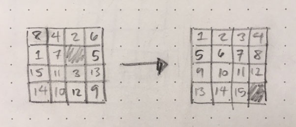
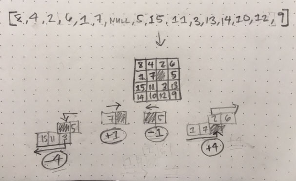

# 15 Puzzle

Site: https://mlizchap.github.io/15-puzzle/

## For Development
- clone the repo
- install the Node modules with `npm install`
- run the app with `npm run start` and go to port 8080

## Overview

The objective of this game is to re-order the blocks in sequential order starting with 1 and ending with a blank square.  The user can slide a number over the blank square, creating an empty space where the number previously was positioned. The number must be directly to the right, left, top, or bottom of the square.

## Logic
The main data structure behind the logic of the code was an array.  To start the game the array consisted of random numbers 1 through 15 as well as a `null` item.  When the user clicked on an item an algorithm was run to determin if the selected item was next to `null`.  Items directly left and right of the null value straightforward - they must be 1 index away in the positive or negative direction.  

Items directly above and below the null value, however, are a little more complicated.  Since the array was arranged into rows and columns, the positioning of the selected item from an item directly below or above it is detwemined by moving the number of rows to the right or left of the item.

If the selected items is next to the null value, the item selected and the `null` items are swapped. Every time the items are swapped the new array is re-rendered to the DOM.

